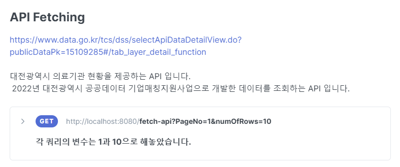

# Swagger Url
http://ec2-3-37-17-244.ap-northeast-2.compute.amazonaws.com/swagger-ui/index.html

# 프로젝트 소개

> HR부서에서 인사관리를 할 때 필요한 사원정보 조회 기능을 제공하는 앱 입니다.
> SpringBoot와 Spring Data JPA를 사용해 기본적인 REST API를 구현하고,
> Docker, AWS EC2를 이용해 서버를 배포했습니다.

github: https://github.com/eternityhwan/EecoAndRichTest/edit/main/README.md

# 과제(프로젝트) 내용

## 사용 기술스택 및 데이터베이스

1. JAVA
2. SPRINGBOOT
3. MYSQL
4. SPRING SECURITY
5. DOCKER
6. AWS EC2

## 개발 요구 사항 & 필수 구현(포함) 기능
1. 특정 사원의 현재 정보 조회 가능한 API 구현
2. 특정 사원의 이력 정보 조회 가능한 API 구현
3. 특정 사원의 현재 정보와 이력 정보 조회 시 같은 사원의 ID 값을 입력하였을 경우
4. 특정 데이터 값이 맞지 않는 경우가 있을 수 있습니다. 무시하고 진행하시면 됩니다.
5. 부서 및 위치 정보 조회 가능한 API 구현
6. 특정 부서의 급여를 특정 비율로 인상 및 사원 정보 업데이트 할 수 있는 API 구현
   RDBMS 스키마와 별개로 공공 데이터 포털( www.data.go.kr ) 등에서 임의의 API 선택 후 조회 가능하도록 커스터마이징된 API 구현

# API 명세서

| Domain       | URL                                 | httpMethod | descrption                                          | 접근권한 |
| ------------ | ----------------------------------- | ---------- | --------------------------------------------------- | -------- |
| fetch-api    | /?{PageNo=1}?{numOfRows=10}         | GET        | 대전광역시 의료기관 현황을 제공하는 API 입니다.     | -        |
| departments  | /{id}                               | GET        | 부서 정보 조회 API 입니다.                          | -        |
|              | /{departmentName}/{increase-salary} | POST       | 특정 부서의 급여를 특정 비율로 인상하는 API 입니다. | -        |
| employees/v1 | /{id}                               | GET        | 사원 정보를 조회하는 API입니다                      | -        |
|              | /history/{employeeId}               | GET        | 사원 이력 조회 API 입니다.                          | -        |
| location/v1  | /                                   | GET        | 위치 정보 모두 조회하는 API 입니다.                 | -        |
|              | /{id}                               | GET        | 특정 사원 위치 조회 API 입니다.                     | -        |

